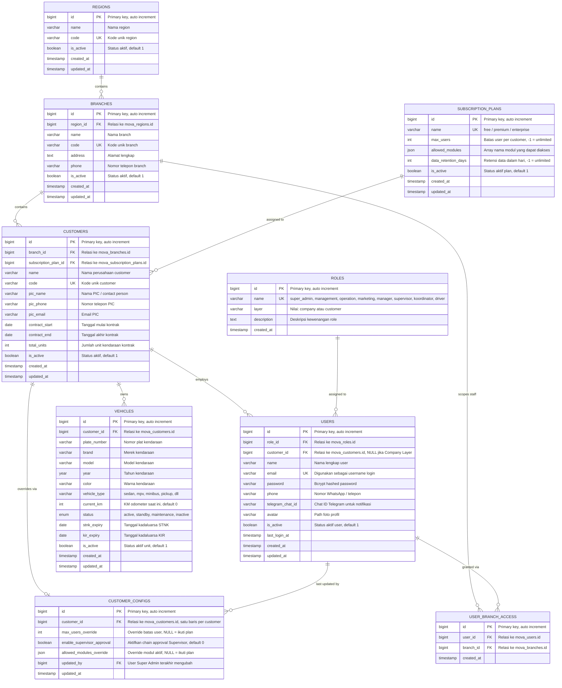
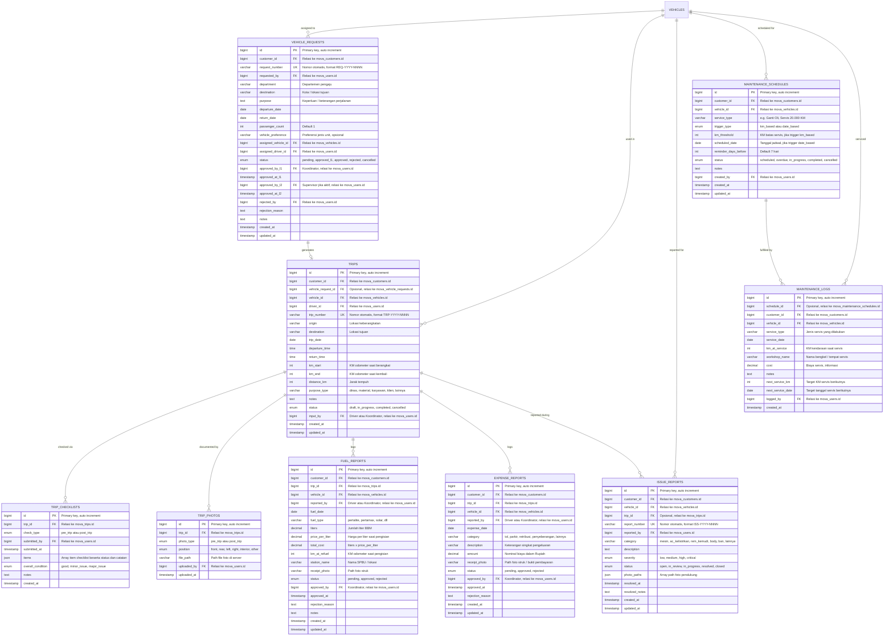
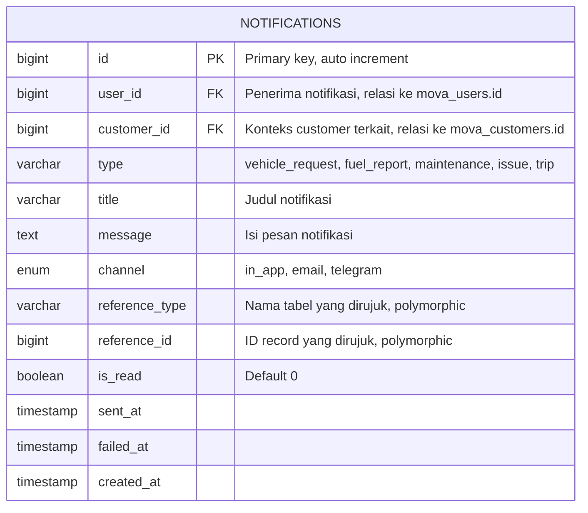

# MOVA — Entity Relationship Diagram

Dokumen ini berisi ERD lengkap platform **MOVA** (Fleet & Driver Management Platform) dalam format [Mermaid](https://mermaid.js.org/syntax/entityRelationshipDiagram.html), sehingga dapat langsung di-render oleh GitHub, GitLab, Notion, mkdocs, atau tools ERD lain, maupun diparsing otomatis oleh sistem code-generation (migration builder, ORM scaffolding, dsb).

- **Database engine**: MySQL 8.0 / MariaDB 10.6+
- **Prefix tabel**: seluruh tabel menggunakan prefix `mova_`
- **Isolasi multi-tenant**: setiap tabel transaksional wajib memiliki `customer_id` sebagai filter query
- **Referensi lengkap**: lihat `MOVA-PRD-v1.0.docx` bagian 6 untuk deskripsi kolom per baris

---

## 1. Struktur Organisasi & Master Data

Mencakup hierarki Region → Branch → Customer, Subscription Plan, Role & User, serta Master Kendaraan.

---

## 2. Data Operasional

Mencakup Vehicle Request, Trip & Driver Log, Driver Self-Service (checklist, foto, laporan kerusakan), Laporan BBM & Biaya, serta Maintenance.

---

## 3. Notifikasi (Tabel Polymorphic)

`mova_notifications` sengaja dipisah dari dua diagram di atas karena bersifat **polymorphic** — kolom `reference_type` dan `reference_id` dapat merujuk ke tabel manapun (vehicle_requests, fuel_reports, maintenance_schedules, issue_reports, dll), sehingga tidak digambarkan sebagai FK tetap.

**Aturan polymorphic reference:**

| `reference_type` | Tabel yang dirujuk |
|---|---|
| `vehicle_request` | `mova_vehicle_requests` |
| `fuel_report` | `mova_fuel_reports` |
| `expense_report` | `mova_expense_reports` |
| `maintenance_schedule` | `mova_maintenance_schedules` |
| `issue_report` | `mova_issue_reports` |
| `trip` | `mova_trips` |

---

## 4. Ringkasan Relasi Antar Tabel

| Tabel Induk | Relasi | Tabel Anak | Kardinalitas |
|---|---|---|---|
| `mova_regions` | contains | `mova_branches` | 1 → N |
| `mova_branches` | contains | `mova_customers` | 1 → N |
| `mova_branches` | scopes staff | `mova_user_branch_access` | 1 → N |
| `mova_subscription_plans` | assigned to | `mova_customers` | 1 → N |
| `mova_customers` | overrides via | `mova_customer_configs` | 1 → 1 |
| `mova_customers` | employs | `mova_users` | 1 → N |
| `mova_customers` | owns | `mova_vehicles` | 1 → N |
| `mova_roles` | assigned to | `mova_users` | 1 → N |
| `mova_users` | granted via | `mova_user_branch_access` | 1 → N |
| `mova_vehicles` | assigned to | `mova_vehicle_requests` | 1 → N |
| `mova_vehicle_requests` | generates | `mova_trips` | 1 → 0/1 |
| `mova_vehicles` | used in | `mova_trips` | 1 → N |
| `mova_trips` | checked via | `mova_trip_checklists` | 1 → N |
| `mova_trips` | documented by | `mova_trip_photos` | 1 → N |
| `mova_trips` | logs | `mova_fuel_reports` | 1 → N |
| `mova_trips` | logs | `mova_expense_reports` | 1 → N |
| `mova_vehicles` | reported for | `mova_issue_reports` | 1 → N |
| `mova_vehicles` | scheduled for | `mova_maintenance_schedules` | 1 → N |
| `mova_maintenance_schedules` | fulfilled by | `mova_maintenance_logs` | 1 → N |
| `mova_users` | receives | `mova_notifications` | 1 → N |

---

## 5. Catatan untuk Sistem / Code Generation

- Semua tabel transaksional (`vehicle_requests`, `trips`, `fuel_reports`, `expense_reports`, `issue_reports`, `maintenance_schedules`, `maintenance_logs`, `vehicles`) **wajib** memiliki kolom `customer_id` dan setiap query harus difilter berdasarkan kolom ini.
- Kolom bertipe `PK` adalah `BIGINT UNSIGNED AUTO_INCREMENT`.
- Kolom bertipe `FK` mengikuti tipe data kolom `PK` yang dirujuk (`BIGINT UNSIGNED`).
- Kolom `UK` (Unique Key) wajib memiliki index unique di level database.
- Kolom `json` memakai tipe native `JSON` (MySQL 5.7+ / MariaDB 10.2+).
- Kolom `enum` memakai tipe native `ENUM(...)`, nilai yang valid tercantum di kolom deskripsi.
- Semua tabel disarankan memiliki `created_at` dan `updated_at` kecuali dinyatakan lain.
- Nomor otomatis (`request_number`, `trip_number`, `report_number`) di-generate di sisi server dengan format `[PREFIX]-[YEAR]-[4DIGIT_SEQUENCE]`.

---

*Dokumen ini adalah pendamping teknis dari `MOVA-PRD-v1.0.docx`. Untuk deskripsi bisnis, alur approval, dan subscription plan, rujuk ke dokumen PRD utama.*
